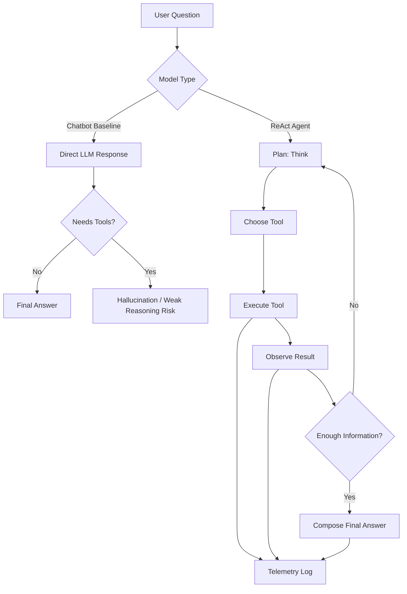

# Flowchart & Insight

This document captures the visual logic of our chatbot-to-agent workflow and the key learning points from the lab.

## 1. Visual Logic Diagram

## 2. Group Insights

- The baseline chatbot is fast, but it struggles when the task needs external facts, calculations, or multi-step reasoning.
- The ReAct loop improves reliability because the model can verify its own reasoning using tools before answering.
- Tool design matters as much as prompt design; unclear input/output contracts create failed calls and noisy traces.
- Telemetry makes debugging practical. We can see where the agent loops, where parsing fails, and which tool call caused the issue.
- The best improvement was not a bigger prompt, but a tighter control loop with clear tool selection, validation, and stop conditions.